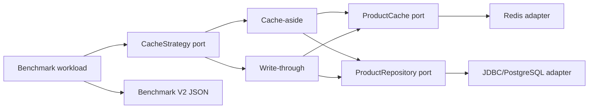

# #19 cache-strategies-bench: 4.858 ms vs 4.066 ms median p95

**Claim:** under the same 80/20 workload on Redis 7 and PostgreSQL 16, write-through produced `100%` cache hits and `4.066 ms` median p95; cache-aside produced `80.40%` hits and `4.858 ms` median p95, with zero stale cached values across three runs.

[](https://github.com/Brilhante29/cache-strategies-bench/actions/workflows/ci.yml)

## What It Proves

- Cache-aside and write-through execute against real Redis and PostgreSQL adapters.
- Domain strategies depend on `ProductCache` and `ProductRepository` ports, not Spring or infrastructure.
- Equal deterministic workloads expose hit ratio, p95, p99, throughput, and consistency failures.
- Every result contains three samples, workload digests, environment, provenance, and a comparability key.
- The default path is local-first and requires no account, cloud service, or secret.

## Run

```powershell
docker compose up --build --abort-on-container-exit --exit-code-from benchmark benchmark
docker compose down --volumes
```

After the implementation is committed, the provenance-aware runner regenerates the tracked result:

```powershell
powershell -NoProfile -ExecutionPolicy Bypass -File tools/benchmark.ps1
```

Result: `benchmarks/results/cache-strategies-v2.json`.

## Benchmark

| Metric | Cache-aside | Write-through | Direction |
|---|---:|---:|---|
| hit ratio | 80.40% | 100.00% | higher |
| median p95 | 4.858 ms | 4.066 ms | lower |
| median p99 | 8.114 ms | 6.802 ms | lower |
| median throughput | 578.58 ops/s | 859.71 ops/s | higher |
| stale cached values | 0 | 0 | exactly 0 |

Workload: 100 products, seed 42, 80% reads, 20% writes, 200 warm-up operations and 2,000 measured operations per strategy in each of three sequential repetitions. Measured locally on 2026-08-10 with Java 21, Redis 7, PostgreSQL 16 and Docker Desktop.

The result does not claim universal superiority. Write-through moves work to the write path and keeps this workload hot; cache-aside accepts misses after invalidation. Network topology, concurrency, TTL, dataset size and write ratio can change the outcome.

## Architecture



Dependency direction:

```text
Spring/JDBC/Redis adapters -> domain ports and strategies
benchmark orchestration -> domain ports
```

`InMemoryCache` and `InMemoryProductStore` are fast test adapters. Production benchmark wiring uses Redis and PostgreSQL through the same contracts, preserving LSP.

## Decisions

- Hexagonal boundaries are justified because replacing local test doubles with networked infrastructure is central to the proof.
- Spring JDBC keeps PostgreSQL behavior explicit; JPA adds no value to this key-value workload.
- Spring Data Redis supplies Lettuce connection management and TTL operations.
- REST is disabled: the repository proves cache strategy behavior, not an HTTP API.
- No Kafka or RabbitMQ is used because there is no asynchronous delivery requirement.
- Kumo is not used because the proof needs Redis and PostgreSQL, not AWS API emulation.

## SOLID And Simplicity

- SRP: strategy, cache adapter, persistence adapter, benchmark producer and validation are separate.
- OCP/LSP: real and in-memory adapters implement the same narrow ports.
- ISP/DIP: strategies see only cache and repository operations they use.
- KISS: one entity, two strategies, two infrastructure services and one workload.
- YAGNI: no controller, ORM, broker, cloud SDK, service mesh or generic cache framework.

## Verification

```powershell
./gradlew.bat clean test --no-daemon
powershell -NoProfile -ExecutionPolicy Bypass -File tools/validate-project.ps1 -SkipDocker
```

CI also starts real Redis and PostgreSQL, regenerates a smoke V2 artifact and uploads it from the exact commit.

## Limits

- Runs are single-threaded so strategy cost is isolated; concurrency is a separate benchmark dimension.
- Redis uses no persistence because cache durability is not part of the claim.
- PostgreSQL is a single local instance; no replication or failover is claimed.
- `KEYS` is used only to reset the bounded benchmark namespace and is not a production scan recommendation.

See `REFERENCES.md` for official documentation and license notes.
