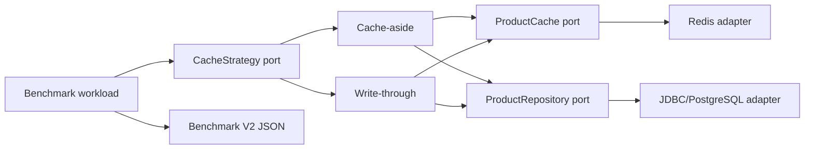

# Cache Strategies Benchmark: Cache-Aside vs Write-Through on Redis and PostgreSQL

**Write-through: `100%` hits and `4.066 ms` median p95. Cache-aside: `80.40%` hits and `4.858 ms` median p95.** Same 80/20 read-write workload on real Redis 7 and PostgreSQL 16, three runs, zero stale cached values for both strategies.

[](https://github.com/Brilhante29/cache-strategies-bench/actions/workflows/ci.yml)
[](LICENSE)
  

## Why this exists

"Add a cache" is one of the most common performance decisions and one of the least measured. The strategy matters: cache-aside keeps writes cheap but serves misses after every invalidation, while write-through pays on the write path to keep reads hot. And a fast cache that serves stale data is a correctness bug, not an optimization. This repository compares the two strategies the way the decision should be made:

- both strategies run against real Redis and PostgreSQL adapters, behind the same ports;
- the workload is deterministic (seed 42), identical for both, and measured in three sequential repetitions;
- hit ratio, p95, p99, throughput, **and** stale reads are reported together, so speed never hides inconsistency;
- every result carries its samples, workload digests, environment, provenance, and a comparability key.

## Results

| Metric | Cache-aside | Write-through | Direction |
|---|---:|---:|---|
| Hit ratio | 80.40% | 100.00% | higher |
| Median p95 | 4.858 ms | 4.066 ms | lower |
| Median p99 | 8.114 ms | 6.802 ms | lower |
| Median throughput | 578.58 ops/s | 859.71 ops/s | higher |
| Stale cached values | 0 | 0 | exactly 0 |

Workload: 100 products, 80% reads and 20% writes, 200 warm-up operations and 2,000 measured operations per strategy in each of three repetitions (Java 21, Redis 7, PostgreSQL 16, Docker).

**How to read it:** write-through wins **this** workload because the dataset fits in cache and every write refreshes it. It is not a universal verdict; network topology, concurrency, TTL, dataset size, and write ratio can flip the outcome. The harness exists so that question can be answered for a specific workload.

## Quickstart

```bash
docker compose up --build --abort-on-container-exit --exit-code-from benchmark benchmark
docker compose down --volumes
```

Provenance-aware runner for the tracked result (PowerShell 7, on a committed tree): `tools/benchmark.ps1`, writing [`benchmarks/results/cache-strategies-v2.json`](benchmarks/results/cache-strategies-v2.json).

## How it works


```mermaid
flowchart LR
  B["Benchmark workload"] --> S["CacheStrategy port"]
  S --> CA["Cache-aside"]
  S --> WT["Write-through"]
  CA --> C["ProductCache port"]
  WT --> C
  CA --> R["ProductRepository port"]
  WT --> R
  C --> RC["Redis adapter"]
  R --> PG["JDBC/PostgreSQL adapter"]
  B --> J["Benchmark V2 JSON"]
```

Strategies depend on `ProductCache` and `ProductRepository` ports, never on Spring or infrastructure. `InMemoryCache` and `InMemoryProductStore` are fast test adapters; the benchmark wires Redis and PostgreSQL through the same contracts.

## Design decisions

| Decision | Why | Rejected |
|---|---|---|
| Hexagonal ports for cache and store | Swapping test doubles for networked infrastructure is central to the proof | Strategies calling Redis and JDBC directly |
| Spring JDBC | PostgreSQL behavior stays explicit for a key-value workload | JPA |
| Spring Data Redis (Lettuce) | Connection management and TTL operations | Hand-rolled client |
| No HTTP API | The subject is strategy behavior, not an endpoint | A controller that adds noise to timings |
| Single-threaded runs | Isolates strategy cost; concurrency is a separate dimension | Mixing contention into the first comparison |

## Testing

```bash
./gradlew clean test --no-daemon
```

CI also starts real Redis and PostgreSQL, regenerates a smoke V2 artifact, and uploads it from the exact commit.

## Limitations

- Single-threaded; concurrent invalidation races are not exercised.
- Redis runs without persistence because cache durability is not part of the claim.
- One local PostgreSQL instance; no replication or failover.
- `KEYS` is used only to reset the bounded benchmark namespace; it is not a production recommendation.

## Project structure

```text
src/main/   domain strategies and ports, Redis and JDBC adapters, benchmark producer
src/test/   strategy tests with in-memory adapters, contract tests
benchmarks/ V2 results
tools/      provenance-aware runner and validators
sdd/  openspec/  decisions, benchmark plan, handoff
```

## How this repository is built

The project follows the spec-driven workflow of [portfolio-reuse-kit](https://github.com/Brilhante29/portfolio-reuse-kit). Requirements and decisions live in [`sdd/`](sdd) and [`openspec/`](openspec), and [`project.yaml`](project.yaml) records the architecture, stack, and rejected alternatives. Development is AI-assisted and human-governed: [`AGENTS.md`](AGENTS.md) and [`CLAUDE.md`](CLAUDE.md) hold the coding-agent instructions, while tests, validators, and CI decide what gets published.

## Related work

- [go-rate-limiter](https://github.com/Brilhante29/go-rate-limiter): Redis as shared atomic state across nodes.
- [load-test-suite](https://github.com/Brilhante29/load-test-suite): latency curves under increasing load.

See [`REFERENCES.md`](REFERENCES.md) for official documentation and license notes.

## Author

**Guilherme Brilhante**, software engineer working on scalable backends and production AI.
[LinkedIn](https://www.linkedin.com/in/guilhermefreirebrilhanteseveriano/) · [GitHub](https://github.com/Brilhante29) · [Publications](https://dblp.org/pid/353/6812.html)

## License

[MIT](LICENSE).
